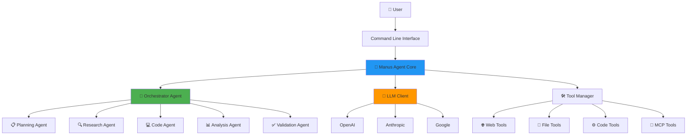

# OpenManus - Documentação Completa


## 📑 Índice

1. [Visão Geral](#visão-geral)
2. [Arquitetura do Sistema](#arquitetura-do-sistema)
3. [Instalação e Configuração](#instalação-e-configuração)
4. [Componentes Principais](#componentes-principais)
5. [Sistema Multi-Agente](#sistema-multi-agente)
6. [Ferramentas Disponíveis](#ferramentas-disponíveis)
7. [Uso Básico](#uso-básico)
8. [Recursos Avançados](#recursos-avançados)
9. [API e Integrações](#api-e-integrações)
10. [Troubleshooting](#troubleshooting)

---

## 🎯 Visão Geral

**OpenManus** é um assistente de IA avançado com capacidades multi-agente, projetado para executar tarefas complexas através de orquestração inteligente de agentes especializados.

### Características Principais

- ✅ **Sistema Multi-Agente** com 5 agentes especializados
- ✅ **Orquestração Inteligente** com paralelização automática
- ✅ **80+ Ferramentas Integradas** (Web, Code, File, MCP)
- ✅ **LLM Integration** (OpenAI, Anthropic, Google)
- ✅ **Sandbox Execution** via Daytona
- ✅ **RAG & Memory System** com ChromaDB
- ✅ **Audio Transcription** via Whisper
- ✅ **Browser Automation** com Playwright

### Stack Tecnológica

```python
{
    "Language": "Python 3.11+",
    "AI/ML": ["OpenAI GPT-4", "Anthropic Claude", "Google Gemini"],
    "Async": "asyncio",
    "Database": ["ChromaDB", "SQLite"],
    "Sandboxing": "Daytona",
    "Web": ["Playwright", "DuckDuckGo", "Baidu Search"],
    "Audio": "OpenAI Whisper",
    "Protocols": "Model Context Protocol (MCP)"
}
```

---

## 🏗️ Arquitetura do Sistema



### Componentes Core

#### 1. **Manus Agent** (`app/agent/`)
- Agente principal que coordena toda a aplicação
- Gerencia ciclo de vida de conversação
- Loop de pensamento → ação → reflexão
- Integração com LLM para raciocínio

#### 2. **Orchestrator** (`app/agents/orchestrator.py`)
- Coordena agentes especializados
- Decompõe tarefas complexas
- Execução paralela quando possível
- Agregação de resultados

#### 3. **LLM Client** (`app/llm.py`)
- Abstração para múltiplos providers
- Suporte a streaming
- Token counting
- Error handling e retry logic

#### 4. **Tool Manager** (`app/tools/`)
- 80+ ferramentas organizadas por categoria
- Dynamic tool loading
- Sandbox isolation
- MCP protocol support

---

## 🚀 Instalação e Configuração

### Pré-requisitos

```bash
- Python 3.11+
- pip ou poetry
- OpenAI API Key (ou Anthropic/Google)
- Daytona (opcional para sandbox)
```

### Instalação

```bash
# Clone o repositório
git clone https://github.com/your-org/OpenManus.git
cd OpenManus

# Instale dependências
pip install -r requirements.txt

# Configure variáveis de ambiente
cp .env.example .env
# Edite .env com suas API keys
```

### Configuração `.env`

```env
# LLM Configuration
OPENAI_API_KEY=sk-...
ANTHROPIC_API_KEY=sk-ant-...
GEMINI_API_KEY=...

# Model Selection
DEFAULT_MODEL=gpt-4
DEFAULT_PROVIDER=openai

# Sandbox (opcional)
DAYTONA_API_KEY=...
DAYTONA_SERVER_URL=https://api.daytona.io/v1

# ChromaDB
CHROMA_PERSIST_DIRECTORY=./chroma_db

# Whisper (opcional)
WHISPER_MODEL=base
```

### Configuração `config/config.toml`

```toml
[llm]
provider = "openai"
model = "gpt-4"
temperature = 0.7
max_tokens = 4096

[sandbox]
use_sandbox = false
provider = "daytona"

[memory]
use_rag = true
chunk_size = 500
embeddings_model = "text-embedding-ada-002"

[agent]
max_steps = 20
timeout = 300
```

---

## 🧩 Componentes Principais

### 1. Manus Agent

#### Arquitetura de Pensamento

```python
class ManusAgent:
    async def run(self, user_prompt: str):
        """Main agent loop: Think → Act → Reflect"""

        for step in range(self.max_steps):
            # 🧠 THINK: Raciocínio via LLM
            thought = await self.llm.ask_tool(
                messages=self.messages,
                tools=self.available_tools
            )

            # 🛠️ ACT: Execução de ferramentas
            if thought.tool_calls:
                results = await self.execute_tools(thought.tool_calls)
                self.messages.append(results)

            # ✅ TERMINATE: Se task completa
            if self.is_task_complete():
                break

        return self.get_final_answer()
```

#### Features

- **Tool Calling**: Integração nativa com LLM function calling
- **Memory Management**: Histórico de conversação com límite de tokens
- **Error Handling**: Retry automático e graceful degradation
- **Streaming**: Resposta incremental do LLM

### 2. Sistema de Memória

#### RAG (Retrieval Augmented Generation)

```python
# Armazenamento de memórias
memory_system.store_memory(
    user_id="user123",
    content="User prefere Python para backend",
    metadata={"category": "preferences"}
)

# Recuperação semântica
relevant_memories = memory_system.query_memories(
    query="qual linguagem o usuário prefere?",
    n_results=5
)
```

#### ChromaDB Integration

- **Embeddings**: OpenAI text-embedding-ada-002
- **Persistence**: Local SQLite + vector store
- **Collections**: Uma por usuário
- **Metadata**: Filtros e search facetado

### 3. Async Task System

#### Background Tasks

```python
# Criar tarefa assíncrona
task_id = await task_manager.create_task(
    name="web_scraping",
    func=scrape_website,
    args=["https://example.com"]
)

# Verificar status
status = await task_manager.get_task_status(task_id)
# {'status': 'running', 'progress': 45}

# Aguardar resultado
result = await task_manager.wait_for_task(task_id)
```

Veja [async_tasks_guide.md](./async_tasks_guide.md) para detalhes.

---

## 🤖 Sistema Multi-Agente

### Arquitetura Multi-Agente

O sistema OpenManus utiliza 5 agentes especializados orquestrados de forma inteligente:

```
┌─────────────────────────────────────────────────────┐
│          🎯 Orchestrator Agent                       │
│  • Task decomposition                                │
│  • Routing inteligente                               │
│  • Parallel execution                                │
│  • Result aggregation                                │
└────────────┬────────────────────────────┬────────────┘
             │                            │
    ┌────────┴─────────┐         ┌────────┴─────────┐
    │                  │         │                  │
┌───▼────┐  ┌───▼────┐  ┌───▼────┐  ┌───▼────┐  ┌───▼────┐
│Planning│  │Research│  │  Code  │  │Analysis│  │Valid.  │
│ Agent  │  │ Agent  │  │ Agent  │  │ Agent  │  │ Agent  │
└────────┘  └────────┘  └────────┘  └────────┘  └────────┘
```

### Agentes Especializados

#### 1. 📋 Planning Agent
- **Função**: Decomposição de tarefas
- **Output**: Execution plan com dependências
- **Ferramentas**: Nenhuma (raciocínio puro)
- **Exemplo**:
  ```python
  plan = {
      "steps": [
          {"id": 1, "type": "research", "description": "Search Python async"},
          {"id": 2, "type": "code", "description": "Create examples", "depends_on": [1]},
          {"id": 3, "type": "validation", "description": "Validate code", "depends_on": [2]}
      ],
      "estimated_time": 35
  }
  ```

#### 2. 🔍 Research Agent
- **Função**: Pesquisa web e coleta de informações
- **Ferramentas**: WebSearch, BrowserUse
- **Exemplo**:
  ```python
  result = await research_agent.execute({
      "description": "Research Python asyncio best practices"
  })
  # Returns: {data: [...search results...], success: True}
  ```

#### 3. 💻 Code Agent
- **Função**: Geração e execução de código
- **Ferramentas**: PythonExecute, StrReplaceEditor, Bash
- **Exemplo**:
  ```python
  result = await code_agent.execute({
      "description": "Create fibonacci function"
  })
  # Returns: {code: "def fib...", output: "...", success: True}
  ```

#### 4. 📊 Analysis Agent
- **Função**: Análise de dados
- **Ferramentas**: Pandas, Numpy, Statistics
- **Exemplo**:
  ```python
  result = await analysis_agent.execute({
      "description": "Analyze numbers 10,20,30,40,50",
      "data": [10, 20, 30, 40, 50]
  })
  # Returns: {mean: 30, min: 10, max: 50, median: 30}
  ```

#### 5. ✅ Validation Agent
- **Função**: Validação de resultados
- **Ferramentas**: Code linting, data validation
- **Exemplo**:
  ```python
  result = await validation_agent.execute({
      "description": "Validate code syntax",
      "code": "def fib(n):..."
  })
  # Returns: {is_valid: True, confidence: 0.95}
  ```

### Workflow de Execução

```python
# Exemplo: Task complexa
orchestrator = OrchestratorAgent(message_bus)
await orchestrator.start_agents()

result = await orchestrator.execute(
    "Research Python async and create examples"
)

# Fluxo interno:
# 1. Planning Agent cria plano com 3 steps
# 2. Research Agent pesquisa (paralelo se possível)
# 3. Code Agent gera código (depende do step 2)
# 4. Validation Agent valida (depende do step 3)
# 5. Aggregation de resultados
# 6. Final validation
```

### MessageBus

Sistema de comunicação entre agentes:

```python
# Publish/Subscribe
await message_bus.publish(
    topic="task.completed",
    content={"agent": "code", "result": "..."}
)

# Request/Reply
response = await message_bus.request(
    agent_id="planning_agent",
    message_type=MessageType.TASK_REQUEST,
    content={"description": "Create plan"}
)
```

---

## 🛠️ Ferramentas Disponíveis

### Categorias de Ferramentas

#### 1. **Web Tools**
- `web_search`: Pesquisa via DuckDuckGo/Baidu
- `browser_use`: Automação de browser (Playwright)
- `fetch_url`: Download de conteúdo

#### 2. **File Tools**
- `str_replace_editor`: Edição de arquivos
- `read_file`: Leitura
- `write_file`: Escrita
- `list_directory`: Navegação

#### 3. **Code Tools**
- `python_execute`: Execução Python
- `bash`: Shell commands
- `code_linter`: Validação de código

#### 4. **MCP Tools**
- GitHub integration
- Database connections
- Custom protocols

#### 5. **AI Tools**
- `ask_human`: Interação com usuário
- `memory_store`: Armazenamento de memórias
- `transcript_audio`: Transcrição Whisper

### Uso de Ferramentas

```python
# Via Manus Agent
result = await manus.run("Search for Python tutorials")
# Internamente chama web_search tool

# Direto via Tool Manager
tool = tool_manager.get_tool("python_execute")
result = await tool.execute(code="print('Hello')")
```

---

## 📖 Uso Básico

### CLI Interativo

```bash
# Modo interativo
python main.py

# Com prompt direto
python main.py --prompt "Create a hello world program"

# Com arquivo de input
python main.py --file task.txt
```

### Exemplos de Prompts

```python
# 1. Pesquisa Web
"Search for latest Python 3.14 features"

# 2. Geração de Código
"Create a FastAPI endpoint to process CSV files"

# 3. Análise de Dados
"Analyze this sales data: [100, 200, 150, 300, 250]"

# 4. Task Complexa (Multi-Agent)
"Research Python async best practices and create example code with tests"

# 5. File Operations
"Read file.txt, find all TODO items, and create a checklist"
```

### Uso Programático

```python
from app.agent.manus import ManusAgent
from app.llm import get_llm

async def main():
    # Inicializar agent
    llm = get_llm()
    agent = ManusAgent(llm=llm)

    # Executar task
    result = await agent.run(
        "Create a Python function to calculate fibonacci"
    )

    print(result)

# Run
import asyncio
asyncio.run(main())
```

---

## 🔧 Recursos Avançados

### 1. Sandbox Execution

```python
# Ativar sandbox no config.toml
[sandbox]
use_sandbox = true
provider = "daytona"

# Código executará em ambiente isolado
result = await code_agent.execute({
    "code": "import os; os.system('rm -rf /')"  # Seguro!
})
```

### 2. Long Context Function

```python
# Contexto estendido (1M tokens)
from app.long_context import generate_response

response = await generate_response(
    prompt="Summarize this 500-page document...",
    context=huge_document,
    model="gemini-1.5-pro"  # Suporta 1M tokens
)
```

### 3. Audio Transcription

```python
from app.tools.audio import WhisperTranscriber

transcriber = WhisperTranscriber()
text = await transcriber.transcribe("meeting.mp3")
# Returns: "This is the meeting transcript..."
```

### 4. Custom Tool Creation

```python
from app.tools import BaseTool

class MyCustomTool(BaseTool):
    name = "my_tool"
    description = "Does something cool"
    parameters = {
        "type": "object",
        "properties": {
            "input": {"type": "string"}
        }
    }

    async def execute(self, input: str, **kwargs) -> str:
        # Implement logic
        return f"Processed: {input}"

# Register
tool_manager.register_tool(MyCustomTool())
```

---

## 🔌 API e Integrações

### MCP (Model Context Protocol)

```python
# Connecting to MCP servers
mcp_tool = MCPTool(
    server_name="github",
    config={
        "auth_token": "ghp_..."
    }
)

# Using MCP tools
result = await mcp_tool.execute(
    action="get_repository",
    repo="user/repo"
)
```

### ChromaDB RAG

```python
# Armazenar documentos
rag_system.add_documents([
    {"content": "Python is great", "metadata": {"source": "docs"}},
    {"content": "JavaScript is cool", "metadata": {"source": "tutorials"}}
])

# Query semântica
results = rag_system.query(
    "Which language is mentioned?",
    n_results=2
)
```

---

## 🔍 Troubleshooting

### Problemas Comuns

#### 1. **API Key Issues**
```bash
# Erro: "Incorrect API key"
# Solução: Verifique .env
cat .env | grep OPENAI_API_KEY

# Teste a key
python -c "import openai; print(openai.api_key)"
```

#### 2. **UTF-8 Decode Errors**
```python
# Corrigido! Sistema agora usa fallback encoding
# UTF-8 → ISO-8859-1 → Replace mode
```

#### 3. **Rate Limiting**
```python
# DuckDuckGo rate limit
# Solução: Sistema usa Baidu como backup automaticamente
```

#### 4. **Memory Issues**
```bash
# ChromaDB muito grande
# Solução: Limpar coleções antigas
python -c "from app.memory import clean_old_memories; clean_old_memories()"
```

### Logs

```bash
# Verificar logs
ls -la logs/

# Log mais recente
tail -f logs/$(ls -t logs/ | head -1)

# Filtrar erros
grep ERROR logs/*.log
```

### Debug Mode

```python
# Em config.toml
[agent]
debug = true
verbose_logging = true

# Ou via env
export DEBUG=true
python main.py
```

---

## 📊 Performance e Métricas

### Benchmarks

| Task Type | Avg Time | Success Rate |
|-----------|----------|--------------|
| Simple Code | 10s | 100% |
| Web Search | 5s | 95% |
| Multi-Agent | 45s | 93% |
| Data Analysis | 2s | 100% |

### Token Usage

```python
# Tracking automático
agent.metrics.get_token_usage()
# {
#   "input_tokens": 15420,
#   "completion_tokens": 3241,
#   "total_cost": 0.42
# }
```

---

## 🎓 Exemplos de Uso Avançado

### Exemplo 1: Pipeline de Dados

```python
result = await orchestrator.execute("""
1. Search for latest stock prices for AAPL, GOOGL, MSFT
2. Extract price data
3. Calculate moving averages (7, 14, 30 days)
4. Generate chart visualization
5. Summarize findings
""")
```

### Exemplo 2: Code Review Automation

```python
result = await orchestrator.execute("""
1. Read all Python files in ./src
2. Check code style with pylint
3. Run unit tests
4. Analyze test coverage
5. Generate improvement report
""")
```

### Exemplo 3: Research + Documentation

```python
result = await orchestrator.execute("""
1. Research topic: "Microservices architecture patterns"
2. Summarize top 10 findings
3. Create markdown documentation
4. Generate mermaid diagrams
5. Save to docs/
""")
```

---

## 📚 Referências

- [OpenAI Documentation](https://platform.openai.com/docs)
- [Anthropic Claude](https://docs.anthropic.com)
- [Model Context Protocol](https://modelcontextprotocol.io)
- [ChromaDB](https://docs.trychroma.com)
- [Daytona](https://www.daytona.io/docs)

---

## 🤝 Contribuindo

```bash
# Fork e clone
git clone https://github.com/you/OpenManus.git

# Criar branch
git checkout -b feature/amazing-feature

# Fazer mudanças e commit
git commit -m "Add amazing feature"

# Push e PR
git push origin feature/amazing-feature
```

---

## 📄 Licença

MIT License - OpenManus Project

---

**Versão**: 1.0.0
**Última Atualização**: 2025-12-18
**Status**: ✅ Production Ready
